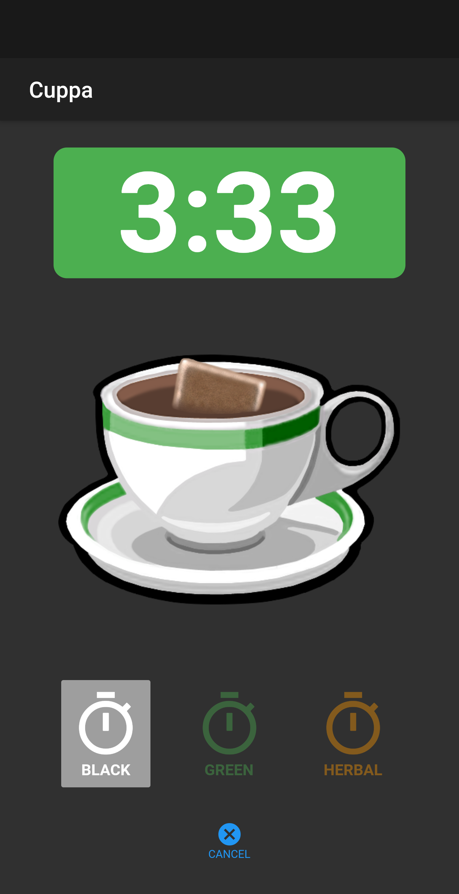
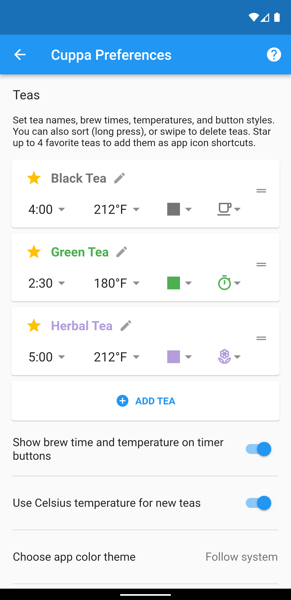
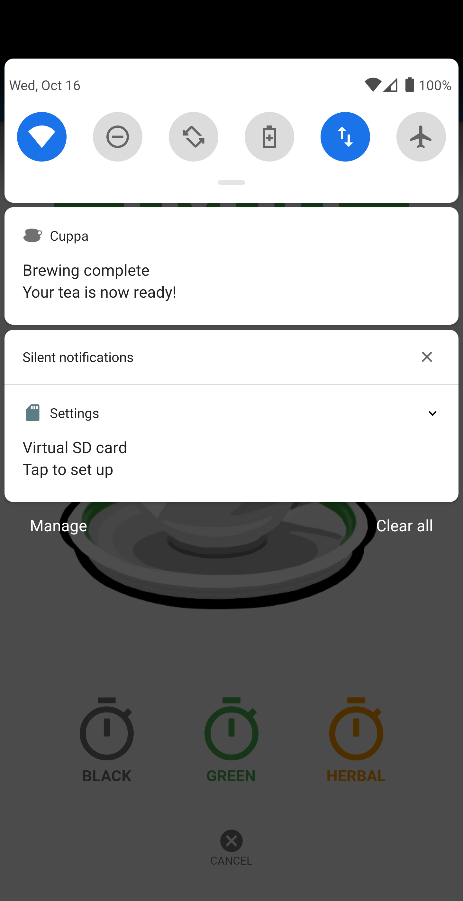

# Cuppa - Tea Timer

### Cuppa is a small application to time your cup of tea as it steeps. Tired of leaving your tea too long, to become bitter and cold, or drinking it too soon and not appreciating its full potential? Then this utility is for you!

**Mobile App for iOS and Android**

To make the app so quick and easy that you'll actually use it, we have built it with simplicity in mind. Just open the app and tap the button for the type of tea you're brewing. That's it. No need to navigate through complicated menus to find a particular tea, or fiddle with settings... unless you want to customize brew times or add your own favorite teas (new in version 1.4!).

Once you tap, Cuppa will begin timing the brew and you'll see a teabag appear in the cup and gradually darken as the tea steeps. A countdown timer shows the steep time remaining. When the tea is done Cuppa will let you know with a notification -- depending on your device settings, this may be accompanied by a sound and/or vibration.

|||
-|-|-|-

**New in [Version 1.4](https://github.com/ncosgray/cuppa_mobile/releases/tag/1.4):**
* A new Preferences page!
* Set your own tea names, brew times, and colors.
* Save settings for three different teas.

||
-|-|-

Requires iOS 10+ or Android 4.1+.

**About Cuppa Mobile**

Cuppa Mobile is a free, open-source mobile app licensed under the terms of the BSD license and built on the [Flutter](http://flutter.io) framework. It is maintained at https://github.com/ncosgray/cuppa_mobile

Author: [Nathan Cosgray](https://www.nathanatos.com)
